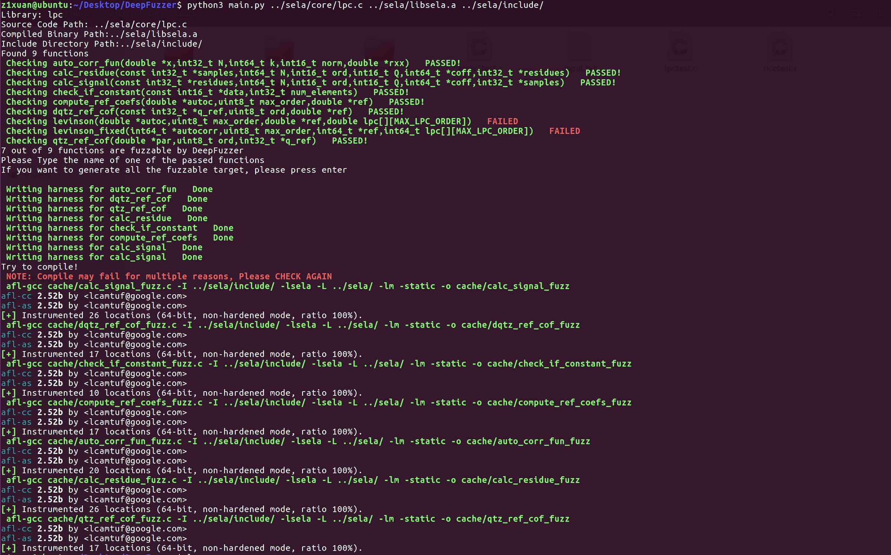

# DeepFuzzer: 
 
## Dependences:
    sudo apt install clang
    sudo apt install clang-format
    sudo apt install cproto

    
## Usage:
    python3 main.py <source code path> <include directory path> <compiled binary file path>

## Example:
Here is an detail [example](./example.md) about how to use DeepFuzzer

## Screenshot:

